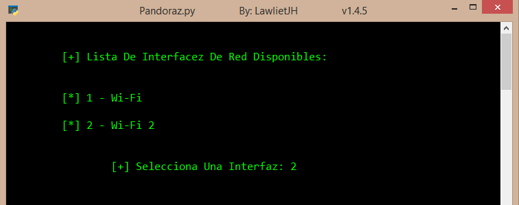
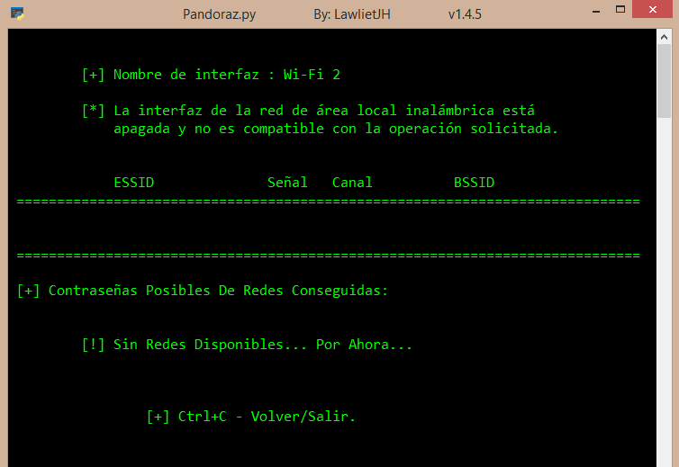
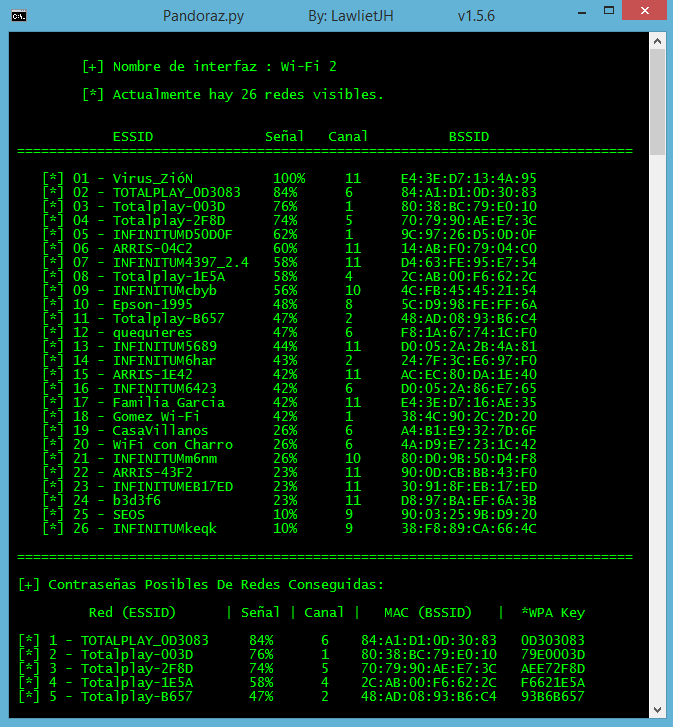

# Pandoraz
## Obten Contraseñas De Redes Wi-Fi En Windows con Python.
## [+] Contraseñas: Totalplay y Huawei.

- - -

### Capturas:

- - -

### Eventod del Teclado:

* Ctrl + C: 

- - -

* [+] Detecta Todas Las __Redes Wi-Fi__ detectadas con tu __Interfaz de Red Wi-Fi__.

* [+] Si existe más de una __Interfaz de Red Wi-Fi__, aparecerá la opción de elegir una de las __Interfaces__ disponibles.

* [+] Las __Contraseñas__ Obtenidas de Redes (Como ___Totalplay___ y ___Huawei___) Se Almacenarán Automaticamente en un __Archivo__ Llamado ___Pass.zion___
  
  * [ \* ] Si de alguna red se consigue su __Contraseña__ y el nombre de la red ya existe en el archivo ___Pass.zion___, no se repetirá la red en el archivo. 

## Redes Que Posiblemente se Obtengas su Contraseña:

***Con Nombres:***

 * "Totalplay-XXXX"
 * "Huawei-XXXX-XXXX"
 * "DG860XXX"
 * "TG862XXX"
