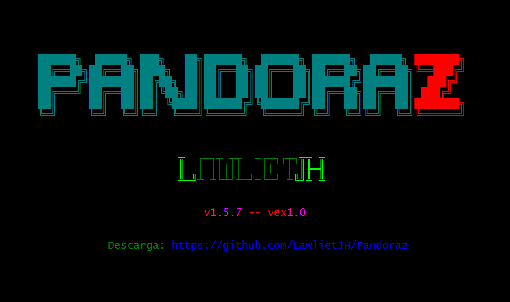
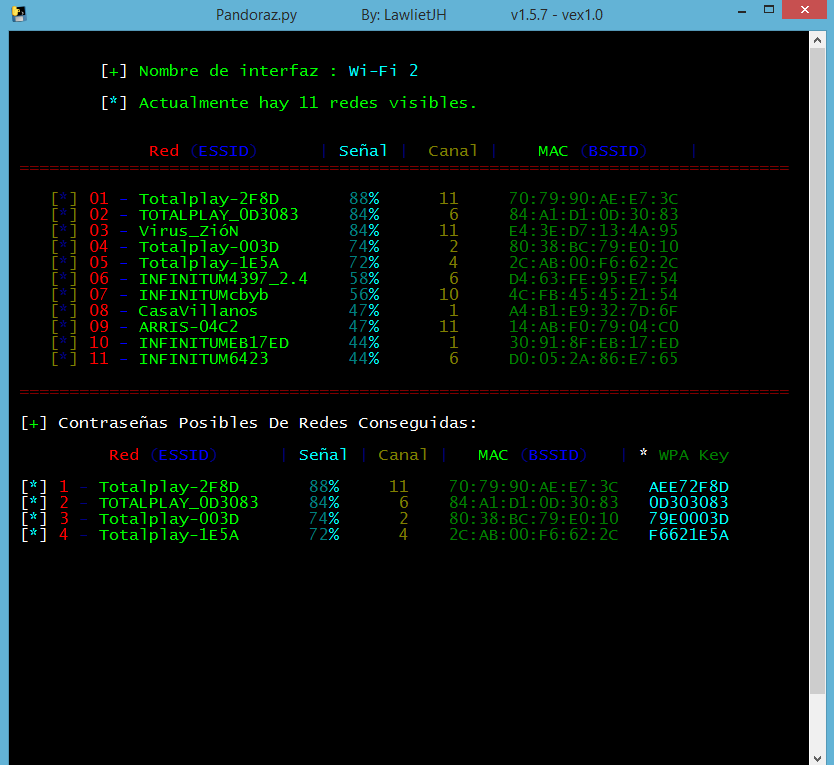
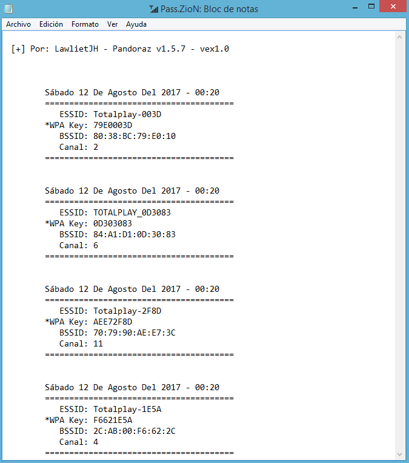
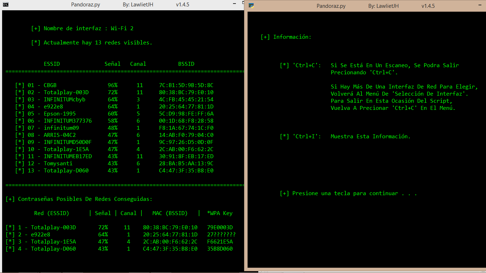

# Pandoraz
## Obten Contraseñas De Redes Wi-Fi En Windows con Python.
## [+] Contraseñas: Totalplay, TOTALPLAY, Ubee y Huawei.
## Versión Actual: v1.5.7 Ejecutable.

### Compatibilidades:

___Pandoraz.py:___

   * __[+] Windows.__
   * __[+] Python 3.4.X.__
   * __[+] Python 3.5.X.__
   * __[+] Python 3.6.X.__

___Pandoraz.exe:___

   * __[+] Windows.__
   * __... No Requiere Nada Más, Solo Ejecutarlo.__
   
- - -

__Pandoraz.exe__

### Eventos del Teclado:

* ___Ctrl + C___ __[Volver/Salir]__:

    * Si Se Está En Un __Escaneo__, Se Podrá __Salir__ Precionando ***'Ctrl+C'*** .
    * Si Hay Más De Una __Interfaz De Red__ Para Elegir, __Volverá__ Al __Menú__ De ***'Selección De Interfaz'*** .
    * Para __Salir__ En Esta Ocasión Del ___Script___ Vuelva A Precionar ***'Ctrl+C'*** En El __Menú__.

* ___Ctrl + P___, __Pausa el Escaneo__:

    * Si Se Está En Un __Escaneo__, Se Podrá __Pausar__ Precionando ***'Ctrl+P'*** .

- - -

__Pandoraz.py__

- - -
### Capturas:

#### Menú de Interfaces de Red (Solo aparecerá si existe más de una Interfaz de Red Inalámbrica, ya sea la Interna y/o Externas):

#### Interfaz Apagada:

#### Escaneo Y Hackeo De Redes Wifi Exitoso:

- - -

### Eventos del Teclado:

* ___Ctrl + C___ __[Volver/Salir]__:

    * Si Se Está En Un __Escaneo__, Se Podrá __Salir__ Precionando ***'Ctrl+C'*** .
    * Si Hay Más De Una __Interfaz De Red__ Para Elegir, __Volverá__ Al __Menú__ De ***'Selección De Interfaz'*** .
    * Para __Salir__ En Esta Ocasión Del ___Script___ Vuelva A Precionar ***'Ctrl+C'*** En El __Menú__.

* ___Ctrl + I___, __Muestra Información [Capturas]__:

- - -

### Más Detalles:

* [+] Detecta Todas Las __Redes Wi-Fi__ detectadas con tu __Interfaz de Red Wi-Fi__.

* [+] Si existe más de una __Interfaz de Red Wi-Fi__, aparecerá la opción de elegir una de las __Interfaces__ disponibles.

* [+] Las __Contraseñas__ Obtenidas de Redes (Como ___Totalplay, TOTALPLAY, Ubee, Huawei___, ect) Se Almacenarán __Automaticamente__ en un __Archivo__ Llamado 📶 ___Pass.ZioN___
  
  * [ \* ] Si de alguna red se consigue su __Contraseña__ y el nombre de la red ya existe en el archivo ___Pass.ZioN___, no se repetirá la red en el archivo.

## Redes Que Posiblemente se Obtenga su Contraseña:

***Con Nombres:***

 * __"UbeeXXXX"__
 * __"Totalplay-XXXX"__
 * __"Huawei-XXXX-XXXX"__
 * __"TOTALPLAY_XXXXXX"__
 * __"DG860XXX"__
 * __"TG862XXX"__
